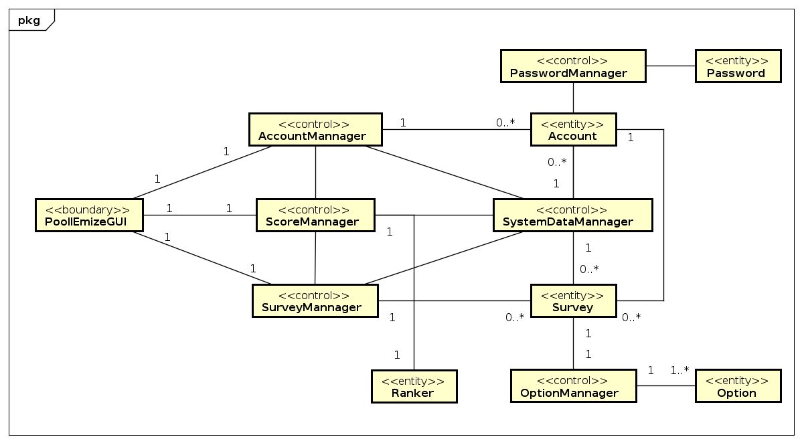
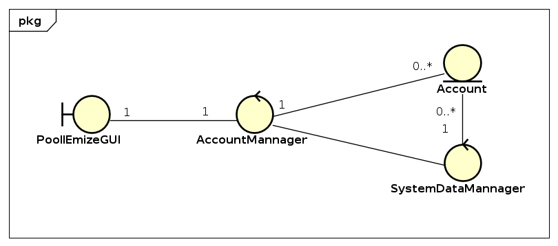

<!-- # PoollEmize

## Descrição da aplicação

Desde os tempos mais antigos a humanidade busca conhecer os padrões existentes no mundo. Uma das ferramentas que criamos para esse fim foi a coleta e análise de dados. Os primeiros censos demográficos que se tem notícia foram elaborados pelos chineses e romanos e eram executados por militares e fiscais. O mais antigo é datado de 2238 a.C. realizado na China pelo imperador Yao com o objetivo de coletar informações sobre o número de pessoas e lavouras cultivadas.

Dentre as formas de realização de censo, destacamos as pesquisas de opinião, com o intuito de mostrar a realização da democracia. Elas nos mostram como está a satisfação de um determinado grupo de individuos, ou seja, um país, estado, pessoas de uma mesma religião, etc; com relação ao assunto abordado pela pesquisa.

Desenvolveremos nesse projeto um sitema que visa gerenciar essas pesquisas. Nosso intuito é, através de enquetes e eleições, falitar a coleta desses dados. Seja para propósitos simples como a cor favorita de determinado grupo de indivíduos ou algo mais complexo como a eleição para presidente de um país. Nela, o usuário poderá criar e gerenciar sua própria pesquisa ou eleição.

## Requisitos

Regras gerais deste sistema:
- O sistema possui eleitores e juizes de eleição.
- As enquetes/eleições só devem ser cadastradas por juízes de eleição.
- Qualquer usuário não cadastrado é eleitor. Eleitores e juízes de eleição podem votar livremente de acordo com as regras estabelecidas pelo juiz criador da enquete/eleição.
- Juízes de eleição não podem modificar votos, apenas validá-los.
- Todo voto é secreto e direto, ou seja, apenas juízes podem ver quem votou e divulgar o resultado da votação de suas próprias enquetes/eleições.
 -->

# PoollEmize

+ Projeto de modelagem
+ Sistema de gerenciamento de votos

*Discente:* Ailson Forte dos Santos

*Disciplina:* DIM0504 - Análise de Projeto Orientado a Objetos (APOO)

# Table of Contents

+ [M1](#m1)
	+ [Descrição da aplicação](#descrição-da-aplicação)
	+ [Requisitos](#requisitos)
		+ [Regras gerais deste sistema](#regras-gerais-deste-sistema-)
	+ [Mockups](#mockups)
	+ [Casos de uso](#casos-de-uso)
		+ [Descrição dos casos de uso](#descrição-dos-casos-de-uso)
			+ [Criar Conta (CSU01)](#criar-conta-csu01-)
			+ [Gerenciar Perfil(CSU02)](#gerenciar-perfil-csu02-)
			+ [Criar Enquete/Eleição(CSU03)](#criar-enquete-eleição-csu03-)
			+ [Gerenciar Enquete/Eleição(CSU04)](#gerenciar-enquete-eleição-csu04-)
			+ [Visualizar Dados de Enquete/Eleição(CSU05)](#visualizar-dados-de-enquete-eleição-csu05-)
			+ [Visualizar Enquetes/Eleições de Outros Usuários(CSU06)](#visualizar-enquetes-eleiçães-de-outros-usuários-csu06-)
			+ [Votar(CSU07)](#votar-csu07-)
			+ [Visualizar Pontuações de Usuários(CSU08)](#visualizar-pontuações-de-usuários-csu08-)
	+ [Diagrama de Classes](#diagrama-de-classes)
+ [M2](#m2)
	+ [VCPs](#vcps)
	+ [Diagramas de comunicação](#diagramas-de-comunicação)
	+ [Diagramas de sequência](#diagramas-de-sequência)
	+ [Diagramas de projeto por VCP](#diagramas-de-projeto-por-vcp)
+ [M3](#m3)
	+ [O que mudou no M1/M2](#o-que-mudou-no-m1-m2)
	+ [DTEs](#dtes)
	+ [DdAs](#ddas)
	+ [Diagrama de classes detalhado](#diagrama-de-classes-detalhado)
+ [Bibliografia](#bibliografia)

# M1

## Descrição da aplicação

Desde os tempos mais antigos a humanidade busca conhecer os padrões existentes no mundo. Uma das ferramentas para esse fim é a coleta e análise de dados que possibilita, por exemplo, determinar como um processo pode ser melhorado.

As primeiras coletas de dados sobre um determinado grupo de individuos, denominadas censos demográficos, que se tem notícia, foram elaborados pelos chineses e romanos e eram executadas por militares e fiscais com o intúito de saber, por exemplo, quantos aptos ao serviço militar havia em determinada região ou quanto uma fazenda produzia em sua lavoura. O mais antigo é datado de 2238 a.C. realizado na China pelo imperador Yao com o objetivo de coletar informações sobre o número de pessoas e lavouras cultivadas a fim de monitorar a produção do império.

Dentre as formas de realização de censo, destacamos as pesquisas de opinião, com o intuito de demonstrar a realização da democracia. Elas nos mostram como está a satisfação de um determinado grupo de individuos, ou seja, um país, estado, pessoas de uma mesma religião, etc; com relação ao assunto abordado pela pesquisa que pode ser desde o "melhor tipo de chocolate" ao "futuro presidente da república".

Agora, imagine a seguinte situação: "Geraldo está pretendendo abrir uma empresa de doces na área comercial do bairro de Nazaré, em Natal. Ele esta querendo saber se haverá clientela para seu negócio, para isso, ele estava indo de rua em rua e perguntando aos moradores o que eles acham de sua ideia de negócio. Geraldo ficou muito cansado depois disso e não coseguiu atingir sequer 10\% das ruas desse bairro."
Veja que realização dessas pesquisas pode ser trabalhosa se pensarmos num número muito grande de indivíduos participantes da opnião. Desse modo, coletar os dados demandaria um tempo que poderia ser gasto com novas pesquisas ou outras coisas. Imigine se Geraldo pudesse se teleportar? Seria uma maravilha. Mas isso é humanamente impossível no momento. Por isso, devemos buscar formas viáveis de otimizar esse processo.

Uma solução viável para os tempos atuais é a criação de um sistema de informações. Ele possibilita que uma máquina(desktop, smartphone, notepad, etc) faça um processo, que para um humano é repetitivo e cansativo, de forma ágil, prática e sem se "cansar". Isso facilitaria bastante a vida do Geraldo, pois, se sua coleta de dados resultasse na aceitação do público, ele já estaria implementando sua empresa no bairro.

E é visando essa melhoria no processo de coleta de dados que desenvolveremos nesse projeto um sitema que visa gerenciar enquetes e/ou eleições. Nosso intuito é, através dos dados coletados, fornecer informações aos interessados sobre a opinião da população. Seja para propósitos simples como a cor favorita de determinado grupo de indivíduos ou algo mais complexo como a eleição para presidente de um país. Nela, o usuário poderá criar e gerenciar sua própria pesquisa ou eleição.

Usaremos, para os propósitos especificados acima, uma aplicação em web. Queremos, assim, abranger um público bastante diversificado e possibilitar que usuários possam interagir uns com os outros de forma dinâmica e divertida. Nessa aplicação, teremos um ranking que possibilitará aos usuários uma competição para saber quem possue mais enquetes, quem tem a enquete mais votada, qual usuário possui maior número de votos no geral, etc.

## Requisitos

### Regras gerais deste sistema:

+ O sistema possui eleitores e juizes de eleição.
+ As enquetes/eleições só devem ser cadastradas por juízes de eleição.(RN001)
+ Qualquer usuário não cadastrado é eleitor. Eleitores e juízes de eleição podem votar livremente de acordo com as regras estabelecidas pelo juiz criador da enquete/eleição.(RN002)
+ Juízes de eleição não podem modificar votos, apenas validá-los. (RN003)
+ Todo voto é secreto e direto, ou seja, apenas juízes podem ver quem votou e divulgar o resultado da votação de suas próprias enquetes/eleições.(RN004)

## Mockups

|  |
| :--: |
| *Home Screen* |

|  |
| :--: |
| *Tela de Criação de Enquetes* |

|  |
| :--: |
| *Tela de Visualização de Enquetes para Usuários Não-cadastrados* |

|  |
| :--: |
| *Tela de Ranking* |

|  |
| :--: |
| *Tela de Visualização de Enquetes para Usuários Cadastrados* |

## Casos de uso

|  |
| :--: |
| *Diagrama de casos de uso* |

### Descrição dos casos de uso

#### Criar Conta (CSU01)

*Sumario:* Usuário usa o sistema para criar uma conta de juiz eleitoral.

*Ator primário:* Usuário

| *Fluxo Principal* |
| :- |
| 1. O usuário solicita a realização do cadastro. |
| 2. O usuário é redirecionado para a tela de cadastro. |
| 3. O usuário preenche suas informações, confirma o cadastro e aguarda verificação de email. |
| 4. Após a verificação do cadastro, os dados são enviados ao servidor e o usuário é direcionado a tela principal de enquetes/eleições. |

*Pós-condições:* O usuário se torna juiz.

#### Gerenciar Perfil(CSU02)

*Sumario:* Usuário usa o sistema para gerenciar suas informações pessoais na conta de juiz eleitoral.

*Ator primário:* Usuário

*Precondições:* O usuário é juiz.

|*Fluxo Principal* |
| :- |
|1. O usuário solicita ao sistema a visualização dos dados cadastrados. |
|2. O usuário é redirecionado para a tela de configurações. |
|3. O usuário visualiza suas informações. |
|4. Após a verificação dos dados, eles são enviados ao servidor e o usuário é direcionado a tela principal de enquetes/eleições. |

|*Fluxo Alternativo(03):* |
| :- |
| a. O usuário atualiza as informações da enquete. |

*Pós-condições:* O cadastro está atulaizado ou o usuário apenas verificou suas informações.

#### Criar Enquete/Eleição(CSU03)

*Sumario:* Usuário usa o sistema para gerenciar informações de suas enquetes/eleições.

*Ator primário:* Usuário 

*Precondições:* O usuário é juiz.

| *Fluxo Principal* |
| :- |
| 1. O usuário solicita ao sistema a visualização das enquetes/eleições. |
| 2. O usuário é redirecionado para a tela de enquetes/eleições. |
| 3. O usuário aperta o botão de criar nova enquete/eleição.  |
| 4. O usuário entra com as informações da nova enquete/eleição. |
| 5. O usuário confirma as informações. |
| 6. O usuário altera as consigurações de visualização da enquete/eleição. |
| 7. O usuário salva a enquete/eleição no servidor. |
| 8. O usuário é redirecionado a tela de visualização das enquetes/eleições. |

*Pós-condições:* As enquetes/eleições do usuário são atualizadas.

#### Gerenciar Enquete/Eleição(CSU04)

*Sumario:* Usuário usa o sistema para gerenciar informações de suas enquetes/eleições.

*Ator primário:* Usuário 

*Precondições:* O usuário é juiz. O usuário criou, ao menos uma, enquete/eleição.

| *Fluxo Principal* |
| :- |
| 1. O usuário solicita ao sistema a visualização das enquetes/eleições. |
| 2. O usuário é redirecionado para a tela de enquetes/eleições.  |
| 3. O usuário seleciona a enquete/eleição que deseja gerenciar.  |
| 4. O usuário entra com as novas informações da enquete/eleição. |
| 5. O usuário confirma as informações. |
| 6. O usuário salva a enquete/eleição no servidor. |
| 7. O usuário é redirecionado a tela de visualização das enquetes/eleições. |

|*Fluxo Alternativo(04):*|
| :- |
| a. O usuário altera as consigurações de visualização da enquete/eleição. |

*Pós-condições:* As enquetes/eleições do usuário são atualizadas. 

#### Visualizar Dados de Enquete/Eleição(CSU05)

*Sumario:* Usuário usa o sistema para visualizar informações de suas enquetes/eleições.

*Ator primário:* Usuário 

*Precondições:* O usuário é juiz. O usuário criou, ao menos uma, enquete/eleição.

| *Fluxo Principal* |
| :- |
| 1. O usuário solicita ao sistema a visualização das enquetes/eleições. |
| 2. O usuário é redirecionado para a tela de enquetes/eleições.  |
| 3. O usuário seleciona a enquete/eleição que deseja visualizar.  |
| 4. O usuário solicita ser redirecionado a tela de visualização das enquetes/eleições. |

#### Visualizar Enquetes/Eleições de Outros Usuários(CSU06)

*Sumario:* Usuário usa o sistema para visualizar informações de enquetes/eleições de outros \hfill  usuários. 

*Ator primário:* Usuário 

| *Fluxo Principal* |
| :- |
| 1. O usuário solicita ao sistema a visualização das enquetes/eleições. |
| 2. O usuário é redirecionado para a tela de enquetes/eleições.  |
| 3. O usuário seleciona a enquete/eleição que deseja visualizar.  |
| 4. O usuário solicita ser redirecionado a tela de visualização das enquetes/eleições. |

#### Votar(CSU07)

*Sumario:* Usuário usa o sistema para votar em enquetes/eleições de outros usuários.

*Ator primário:* Usuário 

*Precondições:* CSU06.

| *Fluxo Principal* |
| :- |
| 1. O usuário solicita ao sistema a visualização da enquete/eleição que deseja votar. |
| 2. O usuário seleciona a opção de voto desejada. |
| 3. O usuário seleciona o botão de votar. |
| 4. O sistema salva o voto para a validação do juiz. |
| 5. O usuário recebe a confirmação do voto. |
| 6. O usuário é redirecionado a tela de visualização das enquetes/eleições. |

*Pós-condições:* O servidor atualiza os dados da enquete/eleição.

#### Visualizar Pontuações de Usuários(CSU08)

*Sumario:* Usuário usa o sistema para visualizar pontuações de usuários.

*Ator primário:* Usuário 

| *Fluxo Principal* |
| :- |
| 1. O usuário solicita ao sistema a visualização de pontuação. |
| 2. O usuário é redirecionado para a tela de visualização de pontuação.  |
| 3. O usuário seleciona o ranking que deseja visualizar.  |
| 4. O usuário solicita ser redirecionado a tela inicial. |

## Diagrama de Classes

|  |
| :--: |
| *Diagrama de Classes de Domínio* |

# M2

|  |
| :--: |
| *Diagrama de Classes após análise BCE* |

## VCPs

|  |
| :--: |
| *Criar Conta* |

|  |
| :--: |
| *Criar enquete/eleição* |

|  |
| :--: |
| *Gerenciar enquete/eleição* |

|  |
| :--: |
| *Gerenciar Perfil* |

|  |
| :--: |
| *Visualizar dados de enquete/eleição* |

|  |
| :--: |
| *Visualizar enquetes/eleições de outros usuários* |

|  |
| :--: |
| *Visualizar pontuações de usuários* |

|  |
| :--: |
| *Votar* |

## Diagramas de comunicação

|  |
| :--: |
| *Criar Conta* |

| ![Criar enquete/eleição]{communication_diagrams/CriarEnqueteCommunicationDiagram.png) |
| :--: |
| *Criar enquete/eleição* |

|  |
| :--: |
| *Gerenciar Perfil* |

|  |
| :--: |
| *Visualizar dados de enquete/eleição* |

|  |
| :--: |
| *Visualizar enquetes/eleições de outros usuários* |

|  |
| :--: |
| *Votar* |

## Diagramas de sequência

|  |
| :--: |
| *Criar Conta* |

|  |
| :--: |
| *Gerenciar enquete/eleição* |

|  |
| :--: |
| *Gerenciar Perfil* |

|  |
| :--: |
| *Visualizar dados de enquete/eleição* |

|  |
| :--: |
| *Visualizar enquetes/eleições de outros usuários* |

|  |
| :--: |
| *Visualizar pontuações de usuários* |

## Diagramas de projeto por VCP

|  |
| :--: |
| *Criar Conta* |

|  |
| :--: |
| *Criar enquete/eleição* |

|  |
| :--: |
| *Gerenciar enquete/eleição* |

|  |
| :--: |
| *Gerenciar Perfil* |

|  |
| :--: |
| *Visualizar dados de enquete/eleição* |

|  |
| :--: |
| *Visualizar enquetes/eleições de outros usuários* |

|  |
| :--: |
| *Visualizar pontuações de usuários* |

|  |
| :--: |
| *Votar* |

# M3

## O que mudou no M1/M2

Adicionado algumas linhas na descrição do projeto.

Atualizado BCE.

## DTEs

|  |
| :--: |
| *Criar conta - Account* |

|  |
| :--: |
| *Votar - Option* |

|  |
| :--: |
| *Visualizar pontuações de usuários - Ranker* |

|  |
| :--: |
| *Gerenciar enquete/eleição - Survey* |

## DdAs

|  |
| :--: |
| *Criar conta* |

|  |
| :--: |
| *Gerenciar perfil* |

|  |
| :--: |
| *Visualizar enquete/eleição* |

|  |
| :--: |
| *Visualizar dados de enquete/eleição* |

## Diagrama de classes detalhado

|  |
| :--: |
| *Diagrama de classes detalhado* |

# Bibliografia
*BEZERRA, E. Princípios de Análise e Projeto de Sistemas com UML. 3. ed. rev. atual. Elsevier/Campus, 2015. 416 p.*
https://www.aedb.br/seget/arquivos/artigos13/28518220.pdf
https://en.wikipedia.org/wiki/Census
https://en.wikipedia.org/wiki/Demography
